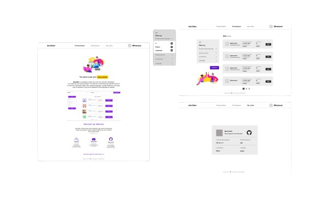
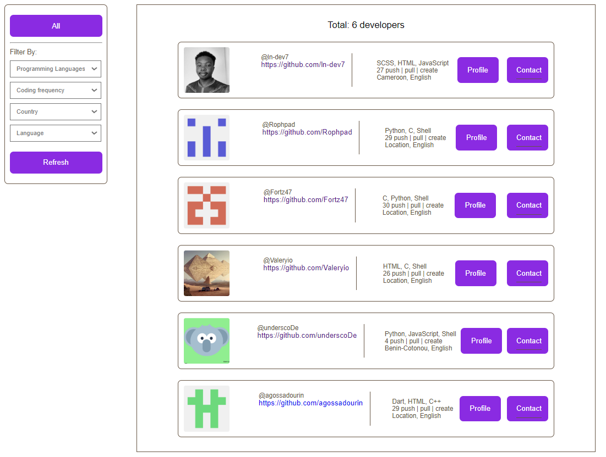

<h1 align="center">
    <a href="https://devxdev.pythonanywhere.com">
    
    </a>
</h1>

<p align="center">
  <i align="center">Github stats to find the ideal project partner 🤝</i>
</p>

<p align="center">
    
</p>

## What is devXdev ?

[devXdev](https://devxdev.pythonanywhere.com) is a platform where you can find the peer developer you need for your group project. It’s used by connecting user github account to retrieve information about his conding language, coding frequency, user localisation and language he speaks.

## Table of content

- [The Story](#the-story)
- [Getting Started](#getting-started)
- [Screenshots](#screenshots)

## The Story

<details open>
<summary>
 Why this app ?
</summary> <br />

During the foundational curriculum at ALX, group projects were completed with assigned partners. However, working with partners in the same time zone who spoke French and English would have been preferable for me. Despite public requests, suitable partners could not be found.

Fellow students also searched for partners with specific criteria like programming language expertise. This inspired an end-of-study project to solve the partner matching problem.

The web app identifies relevant variables to match partners and contains a database of developers open to collaboration. It aims to help students build strong teams and reach their full potential.

</details>

<details open>
<summary>
 Who it will be useful for ?
</summary> <br />

- Students at coding schools/bootcamps like ALX who need to find partners for group projects. The app helps them find partners that meet specific criteria like time zone, languages spoken, or programming language expertise. This allows them to build effective teams.
- Developers or programmers looking to collaborate on side projects or open source contributions. The app's database connects them with like-minded developers open to teaming up.
- Remote workers or digital nomads interested in networking and finding others to collaborate with. The app helps match people based on compatible work styles, skills, time zones, etc.
- Freelancers needing to put together project teams with specific skillsets. The app allows searching for team members based on criteria needed for the project.
- Startups or companies looking to connect talent for short-term gigs. The matching system can identify good fits based on project requirements.

</details>

## Getting Started

Access it on [devxdev.pythonanywhere.com](https://devxdev.pythonanywhere.com).

Or

Run it on your local machine:

Clone the repository.

```bash
git clone https://github.com/Rophpad/devxdev.git
```

Install Flask
```bash
pip3 install Flask
```

Run the app
```bash
flask run
```

## Screenshots

<p align="center">
    
&nbsp;
    
</p>

<p align="center">
    
</p> 

